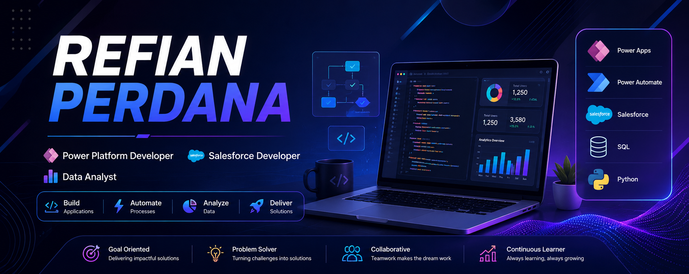

  

<h1 align="center">Hi 👋, I'm Refian Perdana</h1>

<h3 align="center">
Salesforce Developer • Power Platform Developer • Business Process Automation
</h3>

  

---

# 👨‍💻 About Me

I'm **Refian Perdana**, a Salesforce Developer based in Jakarta, Indonesia.

I enjoy building scalable business solutions using **Salesforce**, **Microsoft Power Platform**, and modern web technologies.

My experience includes:

- ⚡ Salesforce Flow Builder
- ☁ Validation Rules
- 📦 Custom Objects
- 🔄 Business Process Automation
- 📊 SQL & Data Analytics
- 🌐 Web Development

Currently learning more about:

- Salesforce Development
- Power Platform
- Cloud Technologies
- Enterprise Automation

---

# 💼 Experience

### Salesforce Developer

**iForte (PT iForte Solusi Infotek)**

- Salesforce Flow
- Validation Rules
- Custom Objects
- Email Notification
- Business Automation

---

### System Analyst

Indonesia National Single Window

- Business Process
- System Analysis
- Requirement Gathering

---

### IT Support

Endurance Challenge Indonesia

- Application Testing
- User Support
- Documentation

---

# 🚀 Tech Stack

### CRM & Cloud

### Languages

### Framework

### Tools

---

# ⭐ Featured Projects

| Project | Description |
|---------|-------------|
| 📄 Tender Document Generator | Power Apps + Power Automate |
| ☁ Salesforce Automation | Flow Builder + Validation Rules |
| 📊 Sales Dashboard | SQL + Looker Studio |
| ♻ Waste Bank System | Laravel + MySQL |

---

# 🔥 Contribution Streak

---

# 📈 Contribution Graph

---

# 🏅 Certifications

- Salesforce Trailhead
- Laravel - Coding Studio
- Front-End Web Development - Dicoding
- Hacktiv8 Independent Study

---

# 📫 Connect With Me

---

⭐ Thank you for visiting my profile ⭐

